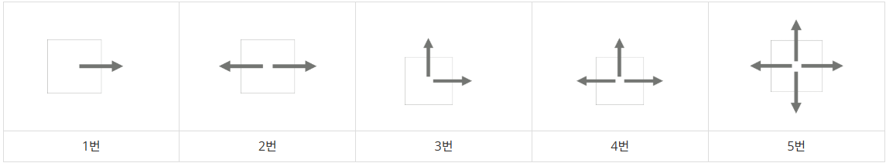

# 15683 감시 (실패)

# 문제 소개

[문제 사이트 링크](https://www.acmicpc.net/problem/15683)

| 시간 제한 | 메모리 제한 | 제출 | 정답 | 맞힌 사람 | 정답 비율 |
| --- | --- | --- | --- | --- | --- |
| 1 초 | 512 MB | 64095 | 31454 | 19372 | 46.104% |

## 문제

스타트링크의 사무실은 1×1크기의 정사각형으로 나누어져 있는 N×M 크기의 직사각형으로 나타낼 수 있다. 사무실에는 총 K개의 CCTV가 설치되어져 있는데, CCTV는 5가지 종류가 있다. 각 CCTV가 감시할 수 있는 방법은 다음과 같다.



1번 CCTV는 한 쪽 방향만 감시할 수 있다. 2번과 3번은 두 방향을 감시할 수 있는데, 2번은 감시하는 방향이 서로 반대방향이어야 하고, 3번은 직각 방향이어야 한다. 4번은 세 방향, 5번은 네 방향을 감시할 수 있다.

CCTV는 감시할 수 있는 방향에 있는 칸 전체를 감시할 수 있다. 사무실에는 벽이 있는데, CCTV는 벽을 통과할 수 없다. CCTV가 감시할 수 없는 영역은 사각지대라고 한다.

CCTV는 회전시킬 수 있는데, 회전은 항상 90도 방향으로 해야 하며, 감시하려고 하는 방향이 가로 또는 세로 방향이어야 한다.

```
0 0 0 0 0 0
0 0 0 0 0 0
0 0 1 0 6 0
0 0 0 0 0 0
```

지도에서 0은 빈 칸, 6은 벽, 1~5는 CCTV의 번호이다. 위의 예시에서 1번의 방향에 따라 감시할 수 있는 영역을 '`#`'로 나타내면 아래와 같다.

| `0 0 0 0 0 0
0 0 0 0 0 0
0 0 1 # 6 0
0 0 0 0 0 0` | `0 0 0 0 0 0
0 0 0 0 0 0
# # 1 0 6 0
0 0 0 0 0 0` | `0 0 # 0 0 0
0 0 # 0 0 0
0 0 1 0 6 0
0 0 0 0 0 0` | `0 0 0 0 0 0
0 0 0 0 0 0
0 0 1 0 6 0
0 0 # 0 0 0` |
| --- | --- | --- | --- |
| → | ← | ↑ | ↓ |

CCTV는 벽을 통과할 수 없기 때문에, 1번이 → 방향을 감시하고 있을 때는 6의 오른쪽에 있는 칸을 감시할 수 없다.

```
0 0 0 0 0 0
0 2 0 0 0 0
0 0 0 0 6 0
0 6 0 0 2 0
0 0 0 0 0 0
0 0 0 0 0 5
```

위의 예시에서 감시할 수 있는 방향을 알아보면 아래와 같다.

| `0 0 0 0 0 #
# 2 # # # #
0 0 0 0 6 #
0 6 # # 2 #
0 0 0 0 0 #
# # # # # 5` | `0 0 0 0 0 #
# 2 # # # #
0 0 0 0 6 #
0 6 0 0 2 #
0 0 0 0 # #
# # # # # 5` | `0 # 0 0 0 #
0 2 0 0 0 #
0 # 0 0 6 #
0 6 # # 2 #
0 0 0 0 0 #
# # # # # 5` | `0 # 0 0 0 #
0 2 0 0 0 #
0 # 0 0 6 #
0 6 0 0 2 #
0 0 0 0 # #
# # # # # 5` |
| --- | --- | --- | --- |
| 왼쪽 상단 2: ↔, 오른쪽 하단 2: ↔ | 왼쪽 상단 2: ↔, 오른쪽 하단 2: ↕ | 왼쪽 상단 2: ↕, 오른쪽 하단 2: ↔ | 왼쪽 상단 2: ↕, 오른쪽 하단 2: ↕ |

CCTV는 CCTV를 통과할 수 있다. 아래 예시를 보자.

```
0 0 2 0 3
0 6 0 0 0
0 0 6 6 0
0 0 0 0 0

```

위와 같은 경우에 2의 방향이 ↕ 3의 방향이 ←와 ↓인 경우 감시받는 영역은 다음과 같다.

```
# # 2 # 3
0 6 # 0 #
0 0 6 6 #
0 0 0 0 #

```

사무실의 크기와 상태, 그리고 CCTV의 정보가 주어졌을 때, CCTV의 방향을 적절히 정해서, 사각 지대의 최소 크기를 구하는 프로그램을 작성하시오.

## 입력

첫째 줄에 사무실의 세로 크기 N과 가로 크기 M이 주어진다. (1 ≤ N, M ≤ 8)

둘째 줄부터 N개의 줄에는 사무실 각 칸의 정보가 주어진다. 0은 빈 칸, 6은 벽, 1~5는 CCTV를 나타내고, 문제에서 설명한 CCTV의 종류이다.

CCTV의 최대 개수는 8개를 넘지 않는다.

## 출력

첫째 줄에 사각 지대의 최소 크기를 출력한다.

## 예제 1

```
4 6
0 0 0 0 0 0
0 0 0 0 0 0
0 0 1 0 6 0
0 0 0 0 0 0
-> 20
```

## 예제 2

```
6 6
0 0 0 0 0 0
0 2 0 0 0 0
0 0 0 0 6 0
0 6 0 0 2 0
0 0 0 0 0 0
0 0 0 0 0 5
-> 15
```

## 예제 3

```
6 6
1 0 0 0 0 0
0 1 0 0 0 0
0 0 1 0 0 0
0 0 0 1 0 0
0 0 0 0 1 0
0 0 0 0 0 1
-> 6
```

## 예제 4

```
6 6
1 0 0 0 0 0
0 1 0 0 0 0
0 0 1 5 0 0
0 0 5 1 0 0
0 0 0 0 1 0
0 0 0 0 0 1
-> 2
```

## 예제 5

```
1 7
0 1 2 3 4 5 6
-> 0
```

## 예제 6

```
3 7
4 0 0 0 0 0 0
0 0 0 2 0 0 0
0 0 0 0 0 0 4
-> 0
```

---

# 초기 접근 방법

- 애초에 입력 값과, 전체 데이터 크기가 작다.
- 브루트포스로 해도 되겠다는 생각이 들었다.

---

# 풀이 과정

- search 함수를 통해 감시할 수 있는 부분을 모두 찾고, 감시할 수 있는 경우의 수를 리턴한다.
    - 이후 search 함수에서 받은 리턴 값을 통해 판별한다.
- 이후 판별한 경우의 수에 대해 실제로 감시함을 배열 안에 -1로 표현하고자 했다.

```cpp

#include <bits/stdc++.h>
using namespace std;

// https://www.acmicpc.net/problem/15683

int n, m, observe;

int room[9][9];

struct cctv {
    int num, x, y;
};

struct canObserve {
    int up, down, left, right;
};

vector<cctv> cctvList;

void input() {
    cin >> n >> m;
    observe = n * m;

    for (int i = 0; i < n; i++) {
        for (int j = 0; j < m; j++) {
            cin >> room[i][j];
            if (room[i][j] != 0 && room[i][j] != 6) {
                cctvList.push_back({room[i][j], i, j});
            }
            if (room[i][j] != 0) {
                observe--;
            }
        }
    }
}

bool compare(cctv c1, cctv c2) {
    return c1.num > c2.num;
}

canObserve search(int x, int y) {
    canObserve s = {0,0,0,0};

    if (x != 0) {
        for (int i = x - 1; i >= 0; i--) {
            // 열
            if (room[i][y] == 6) {
                break;
            }
            if (room[i][y] == 0) {
                 s.up++;
            }
        }
    }

    if (x != n - 1) {
        for (int i = x; i < n; i++) {
            // 아래로 열
            if (room[i][y] == 6) {
                break;
            }
            if (room[i][y] == 0) {
                 s.down++;
            }
        }
    }

    if (y!=0) {
        for (int i = y - 1; i >= 0; i--) {
            // 행
            if (room[x][i] == 6) {
                break;
            }
            if (room[x][i] == 0) {
                 s.left++;
            }
        }
    }

    if (y != m-1) {
        for (int i = y; i < m; i++) {
            // 행
            if (room[x][i] == 6) {
                break;
            }
            if (room[x][i] == 0) {
                s.right++;
            }
        }
    }
    return s;
}

void observeRoom(int x, int y, int up, int down, int left, int right) {
    if (x != 0 && up) {
        for (int i = x - 1; i >= 0; i--) {
            // 열
            if (room[i][y] == 6) {
                break;
            }
            if (room[i][y] == 0) {
                room[i][y] = -1;
            }
        }
    }

    if (x != n - 1 && down) {
        for (int i = x; i < n; i++) {
            // 아래로 열
            if (room[i][y] == 6) {
                break;
            }
            if (room[i][y] == 0) {
                room[i][y] = -1;
            }
        }
    }

    if (y!=0 && left) {
        for (int i = y - 1; i >= 0; i--) {
            // 행
            if (room[x][i] == 6) {
                break;
            }
            if (room[x][i] == 0) {
                room[x][i] = -1;
            }
        }
    }

    if (y != m-1 && right) {
        for (int i = y; i < m; i++) {
            // 행
            if (room[x][i] == 6) {
                break;
            }
            if (room[x][i] == 0) {
                room[x][i] = -1;
            }
        }
    }
}

void solution() {
    // CCTV -> 감시 가능, 벽이 있는 곳 감시 불가능
    /*
     * CCTV
     * - 감시 가능, 벽 쪽 감시 불가능
     * - 회전 가능 (90도)
     *
     * 일단 5번은 어디에 있든 상관 x
     */

    sort(cctvList.begin(), cctvList.end(), compare); // 많은 탐색 기준

    // 감시 가능 -1로 표현

    for (cctv c: cctvList) {
        printf("%d -> %d.%d\n", c.num, c.x, c.y);

        if (c.num == 5) {
            for (int i = 0; i < m; i++) {
                // 행
                if (room[c.x][i] == 6) {
                    break;
                }
                if (room[c.x][i] == 0) {
                    room[c.x][i] = -1, observe--;
                }
            }
            continue;
        }
        if (c.num == 4) {
            canObserve s = search(c.x, c.y);
            int maxOb = s.down+s.left+s.left+s.right;
            max(maxOb-s.down, max (maxOb-s.left, max(maxOb-s.right, maxOb-s.up));
        }

        for () {
            // 90도 회전은 어떻게?
        }
    }

    // CCTV의 최대 개수는 8개를 넘지 않는다. -> 입력 값과 전체 데이터 개수가 적으므로 완전탐색해도 될 듯.

    // 사각 지대를 최소화 해야 한다. 사각지대의 최소 크기를 구하시오.
}

int main() {
    ios::sync_with_stdio(false), cin.tie(NULL), cout.tie(NULL);
    input(), solution();
}

```

---

# 결과 & 근거

- 쉬운 알고리즘이라 생각된다.
- 다만 ‘cctv의 회전을 어떻게 구현하지?’ 라는 생각에서 시간을 허비한 것 같다.
    - 코드를 다 못적어서 실패라고 해두었다.
    - 5번 cctv 처럼 모두 생각한 다음 각 1~4번 경우의 수에 대해 판별하는 알고리즘으로 구현하고자 했다.
    - 시간이 부족했다. 조금은 빡센 구현이 필요한 알고리즘이라 생각된다.
- https://0m1n.tistory.com/115
    - 구현이 빡센 리뷰가 있는 듯하다.

### 알고리즘 분류

- 구현
- 브루트포스 알고리즘
- 시뮬레이션
- 백트래킹