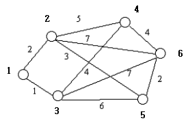

# 1719 택배 (실패)

# 문제 소개

[문제 사이트 링크](https://www.acmicpc.net/problem/1719)

| 시간 제한 | 메모리 제한 | 제출 | 정답 | 맞힌 사람 | 정답 비율 |
| --- | --- | --- | --- | --- | --- |
| 2 초 | 128 MB | 9255 | 5543 | 4031 | 59.140% |

## 문제

명우기업은 2008년부터 택배 사업을 새로이 시작하기로 하였다. 우선 택배 화물을 모아서 처리하는 집하장을 몇 개 마련했지만, 택배 화물이 각 집하장들 사이를 오갈 때 어떤 경로를 거쳐야 하는지 결정하지 못했다. 어떤 경로를 거칠지 정해서, 이를 경로표로 정리하는 것이 여러분이 할 일이다.



예시된 그래프에서 굵게 표시된 1, 2, 3, 4, 5, 6은 집하장을 나타낸다. 정점간의 간선은 두 집하장간에 화물 이동이 가능함을 나타내며, 가중치는 이동에 걸리는 시간이다. 이로부터 얻어내야 하는 경로표는 다음과 같다.


경로표는 한 집하장에서 다른 집하장으로 최단경로로 화물을 이동시키기 위해 가장 먼저 거쳐야 하는 집하장을 나타낸 것이다. 예를 들어 4행 5열의 6은 4번 집하장에서 5번 집하장으로 최단 경로를 통해 가기 위해서는 제일 먼저 6번 집하장으로 이동해야 한다는 의미이다.

이와 같은 경로표를 구하는 프로그램을 작성하시오.

## 입력

첫째 줄에 두 수 n과 m이 빈 칸을 사이에 두고 순서대로 주어진다. n은 집하장의 개수로 200이하의 자연수, m은 집하장간 경로의 개수로 10000이하의 자연수이다. 이어서 한 줄에 하나씩 집하장간 경로가 주어지는데, 두 집하장의 번호와 그 사이를 오가는데 필요한 시간이 순서대로 주어진다. 집하장의 번호들과 경로의 소요시간은 모두 1000이하의 자연수이다.

## 출력

예시된 것과 같은 형식의 경로표를 출력한다.

## 예제 1

```
6 10
1 2 2
1 3 1
2 4 5
2 5 3
2 6 7
3 4 4
3 5 6
3 6 7
4 6 4
5 6 2

->
- 2 3 3 2 2
1 - 1 4 5 5
1 1 - 4 5 6
3 2 3 - 6 6
2 2 3 6 - 6
5 5 3 4 5 -
```

---

# 초기 접근 방법

- 완벽한 다익스트라 문제인 듯 하다
    - 간선에 값 존재.
    - 최단 경로 인데 모든 정점 기준 최단 경로가 필요한.

---

# 풀이 과정

```cpp
#include <bits/stdc++.h>
using namespace std;
// https://www.acmicpc.net/problem/1719

#define INF 1000 // 최대 경로는 1000

int n, m;

vector<vector<pair<int, int>>> logics_vec;
// int logics_arr[100][100];

vector<vector<int>> dij;
vector<vector<int>> result;

void input() {

    cin >> n >> m;

    logics_vec = vector(n+2, vector<pair<int, int>>());

    int from, to, weight;

    for (int i = 0; i < m; i++) {

        cin >> from >> to >> weight;

        logics_vec[from].push_back({to, weight});
        logics_vec[to].push_back({from, weight});
        // logics_arr[from][to] = logics_arr[to][from] = weight;
    }
}

vector<int> dijkstra(int start) {
    vector<int> dist(n+1, INF);
    dist[start] = 0;

    // 가까운 정점 기준, 거리/정점
    priority_queue<pair<int, int>> pq;
    pq.push({dist[start], start});

    while (!pq.empty()) {
        pair<int, int> top = pq.top();
        top.first = -top.first;

        pq.pop();
        for (pair<int, int> next : logics_vec[top.second]) {
            if (dist[next.first] > top.first + next.second) {
                dist[next.first] = top.first + next.second;
                pq.push ({-dist[next.first], next.first});
            }
        }

    }
    return dist;
}

void solution() {

    /*
     * 집하장을 몇 개 마련했지만, 택배 화물이 각 집하장들 사이를 오갈 때 어떤 경로를 거쳐야 하는지 결정하지 못했다.
     * 어떤 경로를 거칠지 정해서, 이를 경로표로 정리하는 것이 여러분이 할 일이다.
     *
     * 모든 집하장 기준에 대한 타 집하장 과의 최단 경로
     * = 모든 집하장에 대한 다익스트라가 필요
     */

    for (int i = 1; i <= n; i++) {
        result.push_back(dijkstra(i));
    }
    result.push_back(dijkstra(0));

    for (int i = 1; i < result.size(); i++){
        for (int j = 1; j < result[i].size(); j++)
            cout << result[i][j] << " ";
        cout << '\n';
    }
}

int main() {
    ios::sync_with_stdio(false), cin.tie(NULL), cout.tie(NULL);
    input();
    solution();
}

```

---

# 결과 & 근거

- 알고리즘을 정확하게 꿰뚫었는데도, 다익스트라를 몰라서 못풀었다.
- pair 변수로 두면서 first, second 랑 거리, 중점을 서로 헷갈리게 두면서 인지하지 못해서 못풀었다…

### 알고리즘 분류

- 그래프 이론
- 최단 경로
- 데이크스트라
- 플로이드-워셜