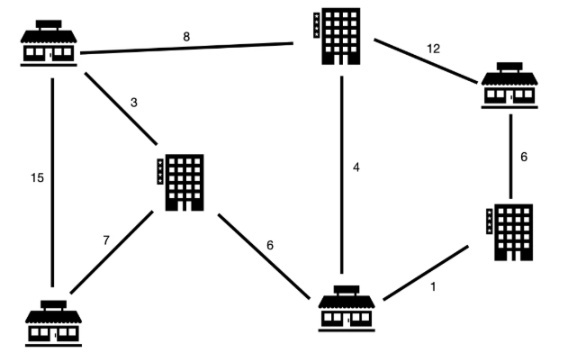

# 21924 도시 건설

# 문제 소개

[문제 사이트 링크](https://www.acmicpc.net/problem/21924)

채완이는 신도시에 건물 사이를 잇는 양방향 도로를 만들려는 공사 계획을 세웠다. 공사 계획을 검토하면서 비용이 생각보다 많이 드는 것을 확인했다. 채완이는 공사하는 데 드는 비용을 아끼려고 한다. 모든 건물이 도로를 통해 연결되도록 최소한의 도로를 만들려고 한다.




위 그림에서 건물과 직선으로 표시된 도로, 해당 도로를 만들 때 드는 비용을 표시해놓은 지도이다.

그림에 있는 도로를 다 설치할 때 드는 비용은 62이다. 모든 건물을 연결하는 도로만 만드는 비용은 27로 절약하는 비용은 35이다.채완이는 도로가 너무 많아 절약되는 금액을 계산하는 데 어려움을 겪고 있다.

채완이를 대신해 얼마나 절약이 되는지 계산해주자.

**입력**

첫 번째 줄에 건물의 갯수 N (3 ≤ N ≤ 100,000)와 도로의 개수 M (2 ≤ M ≤ min (N(N-1)/2, 500,000)   ) 이 주어진다. 두 번째 줄 부터 M+1 줄 까지 ㅈ건물의 번호 a, b (1≤ a, b ≤ N, a≠b) 와 두 건물 사이 도로 건설 비용 c (1≤ c ≤ 1,000,000) 가 주어진다. 같은 쌍의 건물을 연결하는 두 도로는 주어지지 않는다.

**출력**

예산을 얼마나 절약 할 수 있는지 출력한다. 만약 모든 건물이 연결되어 있지 않는다면 -1을 출력한다.

---

# 초기 접근 방법

- 다익스트라 알고리즘과 착각했으나, 더 정확히는 **크루스칼 Kruskal** 알고리즘이었다.
    - 따로 시작점이 정해져있지 않기 때문에 다익스트라 알고리즘으로 풀어도 상관 없으나, 보통 이 알고리즘은 시작점과 도착점 사이의 최소 비용을 찾을 때 사용된다.
    - 그렇기에 시작점 없이 도로 건설 비용 기준으로 최소 건설 비용으로 모든 도시를 연결하는 크루스칼 알고리즘이 해당 문제를 풀기 적합하다.
    - 비슷한 알고리즘으로 프림 Prim 알고리즘이 있다.
- 대신 얼마나 절약할 수 있는 지를 출력해야 한다.
    - 즉 모든 경로의 합에서, 해당 알고리즘으로 구한 최적의 경로를 빼주면 해답을 구할 수 있다.

---

# 풀이 과정

- 먼저 입력을 받으면서 모든 도로 건설 비용의 합을 구해놓는다.
- 각 도시 간 연결 관계는 vector <int>, 연결 리스트 형식으로 하고 각 도시 간 도로 건설 비용은 2차원 배열에 담았다.
- 이번엔 c++ 의 객체를 사용해보고자 한다! 다음과 같이 사용하였다.
    
    ```cpp
    class city2 {
    public:
        int city;
        int next_city;
        int cost;
    };
    
    vector<city2> arr;
    ```
    
    - 프림 알고리즘은 비용 우선 최소 신장 트리 생성 알고리즘 이기에,
- 이후 비용 순으로 정렬 후 반복문으로 순회한다.
    - 현 객체의 도시로부터 연결되는 타겟 도시를 검사한다.
    즉 이 도로를 건설 했을 때, 전체 경로에 사이클이 생기는 지 검사한다.
        - 생기는 경우 continue 처리 한다.
        - 생기지 않는 경우 현 도시 연결 망에 해당 도로를 건설, 추가한다.
    - 마무리 한다!
- 마지막으로 위 과정을 반복하면서 도로 누적합이 생겼을 것이니, 
(최악의 모든 도로 건설 비용) - (최적의 도로 건설 비용) = 해답을 구한다.

```cpp
#include <algorithm>
#include <iostream>
#include <vector>

using namespace std;

// 숫자가 크다, int 로 하면 틀린다....

class City {
public:
    long long cur; // 현재 도시
    long long next; // 연결되는 다음 도시
    long long cost; // 도로 건설 비용
};

bool compare(City c1, City c2) { 
    return c1.cost < c2.cost; // 비용 기준 정렬
}

long long parent [100001];
vector<City> arr, kruskal_arr; // 모든게 연결된 도시, 최적 연결의 도시

long long find_parent (long long child) {
    if (parent[child] == child)
        return child;

    return parent[child] = find_parent(parent[child]);
}

void union_child(long long c1, long long c2){
    c1 = find_parent(c1), c2 = find_parent(c2);

    if (c1 != c2)
        parent[c2] = c1;
}

long long n, m, total, kruskal;

int main() {
    ios_base::sync_with_stdio(false), cin.tie(NULL), cout.tie(NULL);

    cin >> n >> m;
    
    for (int i = 0; i < m; i++) {
        City c = City();
        cin >> c.cur >> c.next >> c.cost;
        arr.push_back(c), total += c.cost;
    }

    sort(arr.begin(), arr.end(), compare);

    for (int i = 1; i<= n; i++)
        parent[i] = i;

    for (City c : arr) {
        if (find_parent(c.cur) != find_parent(c.next)) {
            union_child(c.cur, c.next);
            kruskal+=c.cost;
            kruskal_arr.push_back(c);
        }
    }

    if (kruskal_arr.size() == n-1) {
        cout << total - kruskal << '\n';
    }
    else {
        cout << -1 << '\n';
    }

    return 0;
}

```

---

# 결과 & 근거

- 그래프, 그 중에서도 최소 신장 트리 MST를 공부했으면 단번에 알게 되는 알고리즘 문제이다.
    - 사실 맞았는데, int 로 풀어서 한 번 틀렸다…
- 골드 4 라고 적혀있으나, 골드 5 내지 실버 1로도 충분하다 생각된다.