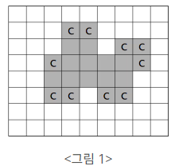

# 2638 치즈

# 문제 소개

[문제 사이트 링크](https://www.acmicpc.net/problem/2638)



N×M의 모눈종이 위에 아주 얇은 치즈가 <그림 1>과 같이 표시되어 있다. 단, N 은 세로 격자의 수이고, M 은 가로 격자의 수이다. 이 치즈는 냉동 보관을 해야만 하는데 실내온도에 내어놓으면 공기와 접촉하여 천천히 녹는다. 그런데 이러한 모눈종이 모양의 치즈에서 각 치즈 격자(작 은 정사각형 모양)의 4변 중에서 적어도 2변 이상이 실내온도의 공기와 접촉한 것은 정확히 한시간만에 녹아 없어져 버린다. 따라서 아래 <그림 1> 모양과 같은 치즈(회색으로 표시된 부분)라면 C로 표시된 모든 치즈 격자는 한 시간 후에 사라진다.


<그림 2>와 같이 치즈 내부에 있는 공간은 치즈 외부 공기와 접촉하지 않는 것으로 가정한다. 그러므 로 이 공간에 접촉한 치즈 격자는 녹지 않고 C로 표시된 치즈 격자만 사라진다. 그러나 한 시간 후, 이 공간으로 외부공기가 유입되면 <그림 3>에서와 같이 C로 표시된 치즈 격자들이 사라지게 된다.

모눈종이의 맨 가장자리에는 치즈가 놓이지 않는 것으로 가정한다. 입력으로 주어진 치즈가 모두 녹아 없어지는데 걸리는 정확한 시간을 구하는 프로그램을 작성하시오.

**입력**

첫째 줄에는 모눈종이의 크기를 나타내는 두 개의 정수 N, M (5 ≤ N, M ≤ 100)이 주어진다. 그 다음 N개의 줄에는 모눈종이 위의 격자에 치즈가 있는 부분은 1로 표시되고, 치즈가 없는 부분은 0으로 표시된다. 또한, 각 0과 1은 하나의 공백으로 분리되어 있다.

**출력**

출력으로는 주어진 치즈가 모두 녹아 없어지는데 걸리는 정확한 시간을 정수로 첫 줄에 출력한다.

---

# 초기 접근 방법

- 최악의 데이터 셋
    - 모눈 종이의 가로 세로, N과 M이 100 인 경우
- BFS의 큐 활용
- 지금 녹아야 할 테두리의 치즈 리스트
    - 치즈만 따로 행 별로 받아두는 게 나을 듯.
- 다음 치즈 리스트?
    - 각 치즈 마다 녹는 걸 파악하는건 너무 비효율적이야
    - 한 치즈당 4의 시간 * 치즈
- null = 0, 치즈 = 1, 내부 공간 = 0 인데, 내부 공간을 어떻게 알아채고 표현하지?
    - **모눈종이의 가장 끝 테두리는 무조건 0이다.**
    - **즉 0,0 에 대한 DFS로 실시하면 나머지 0 은 무조건 내부 공간이다!!!!!!**

먼저 (0,0)에서 빈 공간에 대해 dfs

- 이후 이를 -1로 만들기 (아예 외부 공간)

그냥 치즈 리스트에서 DFS, BFS

- while (치즈 리스트가 null 이 아닐 동안)
    - if (visit 하지 않은 치즈라면?) 해당 치즈에 대해 dfs() 하면서 visit 하기.
    - if 4분면 중 두 사분면 이상이 빈칸이면?
        - 녹아야 할 치즈 리스트에 해당 치즈 추가
- visit 초기화

---

# 풀이 과정

- 치즈에 대해서가 아닌, 빈 공간에 대해 DFS 를 실시하였다.
    - 사실 BFS로 해도 상관 없는 문제이다.
- 녹아야 하는 치즈의 경우 벡터 변수에 잠시 저장했다가, 모든 치즈 검사 후 녹여주었다.
- 외부 공간과 내부 공간을 확실하게 비교해야 하므로, 외부 공간은 -1로 표현해주었다.
- 데이터 셋이 작아, 매번 외부 공간에 대한 그래프 탐색을 실시해도 시간 제한 안에 가능한 알고리즘이었다.
    - 시간 분석도는  외부 공간을 치즈가 녹을 때 까지 DFS, BFS를 반복한다.
    - 즉 O(외부 공간 * 4사분면 검사 시간) * 치즈 녹는 시간 정도인데, 좀 커져도 되지 않을까..?

```cpp
#include <algorithm>
#include <iostream>
#include <queue>
#include <string.h>
#include <vector>

using namespace std;

int n, m, hour, paper[101][101];
bool visit[101][101];

queue<pair<int, int> > cheese;
vector<pair<int, int> > dir = {{-1, 0}, {0, 1}, {1, 0}, {0, -1}}; // 위 부터 시계 방향

void outside_dfs(int x, int y) {
    for (int i = 0; i < dir.size(); i++) {
        int next_x = x + dir[i].first, next_y = y + dir[i].second;
        if (next_x < 0 || next_x >= n || (next_y < 0 || next_y >= m)) 
            continue; // 배열 밖을 벗어난 경우.
        
        if (paper[next_x][next_y] <= 0 && !visit[next_x][next_y]) {
            // 아예 외부 공간 -1 이거나, 녹아서 생긴 외부 공간 0 인 경우
            visit[next_x][next_y] = true;
            paper[next_x][next_y] = -1; // 완전히 외부 공간으로 표현
            outside_dfs(next_x, next_y);
        }
    }
}

int main() {
    ios_base::sync_with_stdio(false), cin.tie(NULL), cout.tie(NULL);

    cin >> n >> m;

    for (int i = 0; i < n; i++) {
        for (int j = 0; j < m; j++) {
            cin >> paper[i][j];
            if (paper[i][j] == 1) cheese.push({i, j}); // cheese.push_back({i, j});
        }
    }

    paper[0][0] = -1;

    // 치즈가 아닌, 치즈가 녹을 때 마다 빈 공간에 대해 DFS를 해주어야 한다.
    while (!cheese.empty()) {
        outside_dfs(0, 0); // 외부 공간에 대한 dfs! 0 -> -1

        queue<pair<int, int>> temp_cheese;
        vector<pair<int, int>> can_melt_cheese;

        while (!cheese.empty()) {
            int can_melt = 0, x = cheese.front().first, y = cheese.front().second;
            for (int j = 0; j < dir.size(); j++) {
                if (paper[(x + dir[j].first)][(y + dir[j].second)] == -1)  // 외부 공간이면?
                    can_melt++;
            }

            if (can_melt < 2)
                temp_cheese.push({x, y}); // 녹지 않는 벡터에 대해서만 벡터에 복사
            else
                can_melt_cheese.push_back({x, y}); // melt! 한 번에 melt 해야 함!

            cheese.pop();
        }

        for (pair<int, int> melt : can_melt_cheese) 
            paper[melt.first][melt.second] = -1;

        cheese = temp_cheese, memset(visit, false, sizeof(visit)), hour++; // 치즈 복붙, visit 초기화, 녹은 시간 ++
    }

    cout << hour << '\n';

    return 0;
}
```

---

# 결과 & 근거

- 잘 푼 거 같은데 왜 틀렸지? 싶었는데 사분면 탐색 표현 변수에서 마이너스 붙히는 걸 깜빡해서 틀렸었다.
- 쨌든 한 번에 풀었다. 문제 해결에 대한 기준을 치즈가 아닌, 공간에 두니 바로 풀 수 있었다. 한 2시간 정도 걸렸던 것 같다.
- 골드 3? 이라기엔 조금 쉬운 문제였던 것 같다.