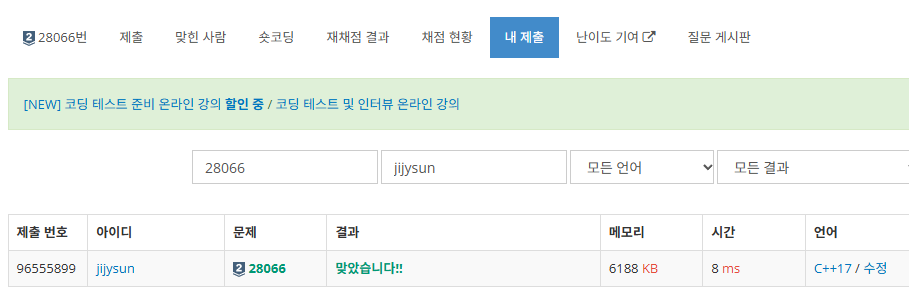

# 28066 타노스는 요세푸스가 밉다

# 문제 소개

https://www.acmicpc.net/problem/28066

N마리의 청설모가 1번부터 N번까지 순서대로 시계 방향으로 원을 이루면서 앉아있다. 타노스는 손을 튕겨서 순서대로 두 번째 청설모를 제거해 왔는데, 옆 나라의 수학자 요세푸스도 이미 그 방식을 사용해 왔다는 것을 알자 기분이 상했다. 그래서 타노스는 새롭게 청설모를 제거하는 방식을 고안했다.

시작은 1번 청설모를 첫 번째 청설모로 한다. 타노스가 손을 튕기면 첫 번째 청설모부터 시계 방향으로 K마리의 청설모가 선택된다. 

이후 첫 번째 청설모를 제외한 2…. K번째 청설모가 번호가 증가하는 순서대로 제거되고 첫 번째 청설모만 살아남는다. 

단, 남아 있는 청설모가 K마리보다 적으면 첫 번째 청설모를 제외한 모든 청설모가 제거된다. 

제거된 후 남아있는 청설모가 2마리 이상일 경우 첫 번째 청설모의 오른쪽 청설모가 첫 번째 청설모가 되고, 제거하는 과정을 다시 진행한다. 이 과정은 청설모가 1마리 남을 때까지 계속된다.

N과 K가 주어질 때 **마지막으로 남는 청설모의 번호를** 구하여라.

제거 과정

- 현 청설모 > K = 1 ~ K 까지 선택 후, 2~K를 제거한다.
    - 제거 후 바로 다음 청설모를 첫 청설모로 정한다.
    제거 된 후 남은 청설모가 2마리 이상인 경우 제거 당시 첫 청설모의 **다음 청설모가 첫 청설모가 된다.**
- 현 청설모 < K = 첫 번째 청설모 제외 모든 청설모를 제거한다.
- 한 마리만 남을 때 까지 반복한다!

또한 시간적 제한이 너그럽지는 않은 문제이다. 

# 초기 접근 방법

이 경우는 연결 리스트로, 손으로 직접 그려보았다. 

이 결과, 다음과 같은 연산과 자료구조? 가 필요로 하게 되었다.

1. 제거 전 첫 청설모를 제외하고 연산을 실행한다. 또한 청설모들은 원으로 둘러앉아 있기에, 첫 청설모는 맨 마지막 청설모가 된다. 즉 스택의 성질을 띄고 있다.
2. K 만큼 타노스 스냅 연산, 즉 앞에서 K 만큼 제거하는 연산이므로 큐의 성질을 띄고 있다.

그래서 스택과 큐를 짬뽕한 덱이 필요할 것 같아 바로 구현에 들어갔다.

# 풀이 과정

```bash
#include <deque>
#include <iostream>

using namespace std;

int n, k;
deque<int> squirrel;

int main() {

    cin >> n >> k;
    for (int i = 0; i<n; i++) {
        squirrel.push_back(i+1);
    }

    while (true) {
        if (squirrel.size() < k) { // 첫 번째 청설모 제외 제거 = 첫 번째 청설모가 답
            break;
        }
        int first_squ = squirrel.front(); // 첫 청설모 추출
        squirrel.pop_front(); // 해당 첫 청설모 제외
        for (int i = 0; i<k-1; i++) { // K 만큼 타노스 연산 = 큐 연산
            squirrel.pop_front();
        }
        squirrel.push_back(first_squ); // 추출한 청설모 맨 뒤로 보낸다 = 스택 연산
    }

    cout << squirrel.front() << '\n';

    return 0;
}
```

코드로 구현 시에는 매우 간단했다.

따로 연산에서 맨 마지막의 청솔모가 되는 연산에서의 첫 청솔모에 집중하였다.

# 결과 & 근거



- DP나 다른 문제 같이 점화식이나 경우의 수를 구해가며 푸는 문제는 아닌지라, 매우 쉽게 풀 수 있었다.

~~확실히 손으로 끄적이는 게 도움이 되는 것 같다.~~