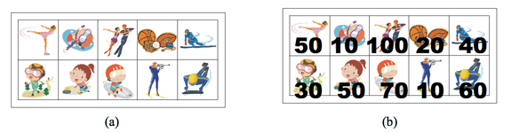

# 9455 스티커 (실패)

# 문제 소개

[문제 사이트 링크](https://www.acmicpc.net/problem/9465)

| 시간 제한 | 메모리 제한 | 제출 | 정답 | 맞힌 사람 | 정답 비율 |
| --- | --- | --- | --- | --- | --- |
| 1 초 | 256 MB | 90919 | 43886 | 31610 | 47.654% |

## 문제

상근이의 여동생 상냥이는 문방구에서 스티커 2n개를 구매했다. 스티커는 그림 (a)와 같이 2행 n열로 배치되어 있다. 상냥이는 스티커를 이용해 책상을 꾸미려고 한다.

상냥이가 구매한 스티커의 품질은 매우 좋지 않다. 스티커 한 장을 떼면, 그 스티커와 변을 공유하는 스티커는 모두 찢어져서 사용할 수 없게 된다. 즉, 뗀 스티커의 왼쪽, 오른쪽, 위, 아래에 있는 스티커는 사용할 수 없게 된다.



모든 스티커를 붙일 수 없게된 상냥이는 각 스티커에 점수를 매기고, 점수의 합이 최대가 되게 스티커를 떼어내려고 한다. 먼저, 그림 (b)와 같이 각 스티커에 점수를 매겼다. 상냥이가 뗄 수 있는 스티커의 점수의 최댓값을 구하는 프로그램을 작성하시오. 즉, 2n개의 스티커 중에서 점수의 합이 최대가 되면서 서로 변을 공유 하지 않는 스티커 집합을 구해야 한다.

위의 그림의 경우에 점수가 50, 50, 100, 60인 스티커를 고르면, 점수는 260이 되고 이 것이 최대 점수이다. 가장 높은 점수를 가지는 두 스티커 (100과 70)은 변을 공유하기 때문에, 동시에 뗄 수 없다.

## 입력

첫째 줄에 테스트 케이스의 개수 T가 주어진다. 각 테스트 케이스의 첫째 줄에는 n (1 ≤ n ≤ 100,000)이 주어진다. 다음 두 줄에는 n개의 정수가 주어지며, 각 정수는 그 위치에 해당하는 스티커의 점수이다. 연속하는 두 정수 사이에는 빈 칸이 하나 있다. 점수는 0보다 크거나 같고, 100보다 작거나 같은 정수이다.

## 출력

각 테스트 케이스 마다, 2n개의 스티커 중에서 두 변을 공유하지 않는 스티커 점수의 최댓값을 출력한다.

## 예제 1

```
2
5
50 10 100 20 40
30 50 70 10 60
7
10 30 10 50 100 20 40
20 40 30 50 60 20 80

-> 
260
290
```

---

# 초기 접근 방법

- 최댓값 + 뭔가 한 열 하나씩 차근차근 접근해야 한다는 생각에 DP 밖에 생각이 안났다.
- 하지만 건너뛰는 걸 어떻게 고려하지?
    - m → 홀수, 짝수에 따라 달라지나?
    - 

---

# 풀이 과정

- 변수 및 라이브러리 사용 이유
- 조건부 해석 이유

```cpp

#include <bits/stdc++.h>

using namespace std;

int n, m;

int sticker [2][100001];
int side_max [100001]; // 한 행만 봐도 되니까

void solution();

void input() {

    // 한 스티커를 쓰면 상하좌우 스티커는 못씀
    // 이런 상황에서 뗄 수 있는 스티커의 최대값,

    cin >> n ;

    for (int i = 0; i < n; i++) {
        cin >> m;
        for (int j = 0; j<2; j++) {
            for (int k = 0; k<m; k++) {
                cin >> sticker[j][k];
            }
        }
        solution();
    }

}

void solution() {

    // dp 이면서 저번에 풀었던 비슷한 문제.
    // 각 끝을 미리 정해서 큰 값 정하고, 비교?

    // m 이 홀수 짝수에 따라 달라지나?
    /*
     * 홀수: 한 줄을 무조건 버려야 함. -> 어떻게? ->  각 홀수 자리 vs 짝수 자리
     * 짝수: 모든 경우의 수
     */

    // 건너뛸 수 있는 조건. ->

    int pre_max = max (sticker[0][0], sticker[1][0]); // 첫 번쨰 행을 버리냐
    int max_index = 0, max_sum = pre_max;

    for (int i = 1; i<m-1 ; i++) {
        // 현재보다 양 옆 큰 값을 고르는 게 더 낫다면?
        int cur_max = max (sticker[0][i], sticker[1][i]);
        int next_max = max (sticker[0][i+1], sticker[1][i+1]);

        if (pre_max + next_max > cur_max) {
            max_index = i;
            max_sum = pre_max + next_max;
        }

        pre_max = cur_max;
    }

}

int main() {
    ios::sync_with_stdio(false);
    cin.tie(nullptr);
    cout.tie(nullptr);

    input(), solution();
    return 0;
}

```

---

# 결과 & 근거

- 타임 아웃. 아이디어만 내다가 제 시간에 풀지 못했다.
- 최대값을 고려해야 한다는 생각에, “어느 거를 건너뛰어야 한다” 라는 생각에서 무한루프를 돌았다.
- 꽤 단순한 DP 임에도 불구하고 못 풀었다는 게 답답하다.
- 정답
    
    단순한 DP 문제였다.
    
    지금 열에서 고를 수 있는 다음 거를 고르냐, 아니면 건너뛰고 그 다음걸 고르는 게 낫냐 이거를 비교하면 되는 거였다….
    
- https://yabmoons.tistory.com/54

### 알고리즘 분류

- 다이나믹 프로그래밍